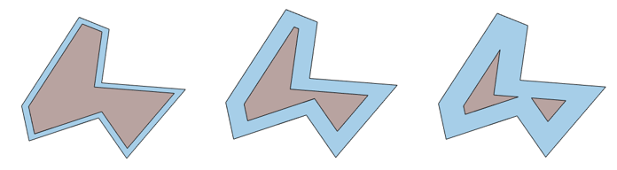
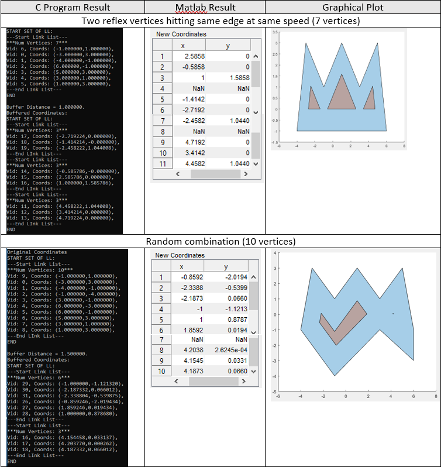
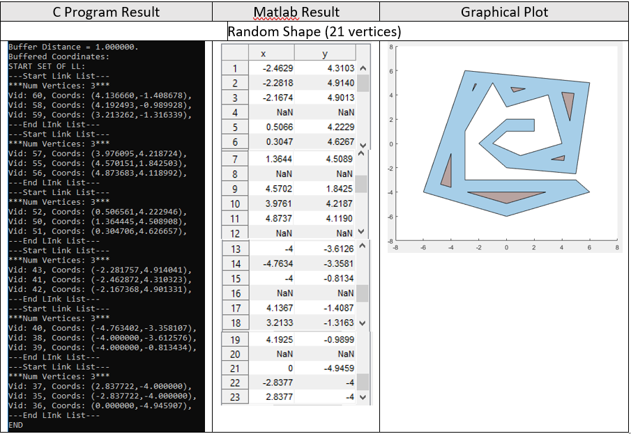

# Polygon-Buffering
The inward buffering of a polygon is when all of its edges are contracted towards its interior in a self-parallel manner at the same speed for each edge. 
Each vertex will move along the angular bisector of its incident edges until there is a change in the polygon topology. 
The program takes the polygon vertices (ordered anti-clockwise) and buffer distance and calculates the new coordinates of the buffered polygon vertices. 
The buffered output may also contain multiple smaller polygons due to split events as can be seen in the following test cases. 
This algorithm is partly based on the Straight Skeleton Algorithm by Petr Felkel and Stepan Obdrzalek.

## Test Cases

